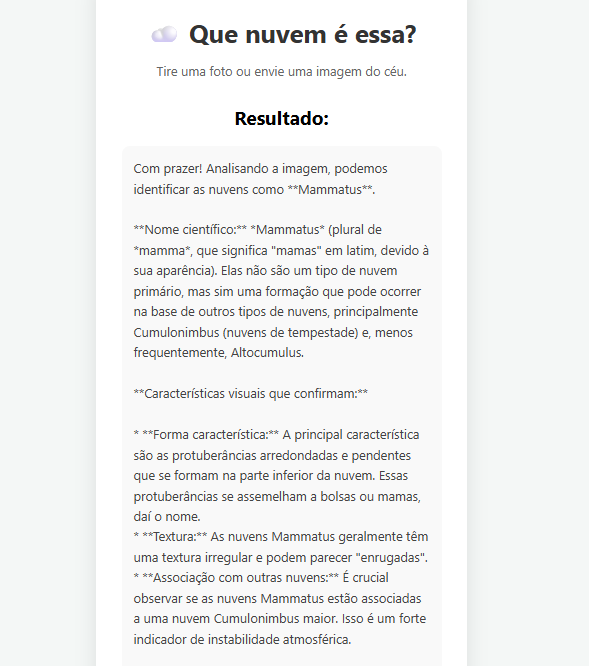

# ☁️ PokeClouds - Analisador de Nuvens com IA

> Um identificador inteligente de formações de nuvens utilizando Go e Inteligência Artificial Multimodal (Gemma 3).


## 📖 Sobre o Projeto

O **PokeClouds** é uma aplicação web que permite aos usuários fazer upload de fotos do céu para identificar tipos de nuvens. O sistema atua como um "meteorologista digital", analisando a imagem e retornando:
- O nome científico da nuvem (ex: *Mammatus*, *Cumulonimbus*).
- As características visuais identificadas.
- A previsão do tempo associada àquela formação.

Este projeto foi desenvolvido como um MVP para explorar a integração entre **Back-end em Go** e **LLMs Multimodais** (Large Language Models) de última geração.

## 📸 Demonstração




## 🚀 Tecnologias Utilizadas

* **Linguagem:** [Go (Golang)](https://go.dev/) - Pela performance e robustez no back-end.
* **Inteligência Artificial:** [Google Gemma 3 (12b)](https://ai.google.dev/gemma) - Modelo open-source multimodal capaz de interpretar imagens e texto.
* **SDK:** Google Generative AI para Go.
* **Front-end:** HTML5, CSS3 e JavaScript (Vanilla).
* **Hospedagem:** Render.

## ⚙️ Arquitetura e Desafios

Um dos principais desafios técnicos deste projeto foi a escolha do modelo de IA. Inicialmente projetado para usar o **Gemini**, o projeto migrou para o **Gemma 3 12b** para otimizar os limites de requisição (Rate Limits), permitindo um uso massivo gratuito sem perder a capacidade de visão computacional (multimodalidade).

## 🔧 Como rodar localmente

### Pré-requisitos
* [Go](https://go.dev/dl/) instalado.
* Uma chave de API do [Google AI Studio](https://aistudio.google.com/).

### Passo a passo

1.  **Clone o repositório**
    ```bash
    git clone [https://github.com/JovemN00bl/PokeClouds.git](https://github.com/JovemN00bl/PokeClouds.git)
    cd PokeClouds
    ```

2.  **Instale as dependências**
    ```bash
    go mod tidy
    ```

3.  **Configure a Chave de API**
    * No Linux/Mac: `export GEMINI_API_KEY="sua_chave_aqui"`
    * No Windows (PowerShell): `$env:GEMINI_API_KEY="sua_chave_aqui"`

4.  **Execute o servidor**
    ```bash
    go run main.go
    ```

5.  **Acesse**
    Abra seu navegador em `http://localhost:8080`

## ☁️ Exemplo de Uso

**Prompt do Sistema:**
> "Atue como um meteorologista especialista. Identifique qual tipo de nuvem é esta na imagem. Diga o nome científico..."

**Resposta da IA (Exemplo):**
> "Analisando a imagem, podemos identificar as nuvens como **Mammatus**. A principal característica são as protuberâncias arredondadas..."

## 🤝 Contribuição

Contribuições são bem-vindas! Sinta-se à vontade para abrir issues ou enviar pull requests.

## 📝 Licença

Este projeto está sob a licença MIT.
